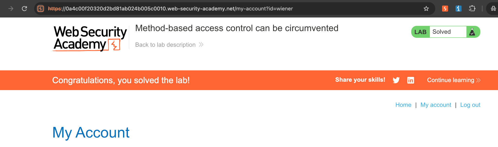
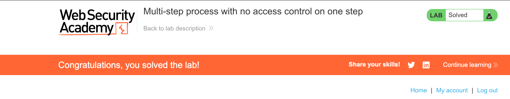

# Access-Control Testing: Method and Workflow Bypasses

## Overview

This case study documents two access-control vulnerabilities identified and exploited in deliberately vulnerable PortSwigger Web Security Academy labs. Testing was performed only within the authorised training environment.

The endpoint enforced authorisation for `POST` requests but allowed the same privileged action through `GET`. A standard user could exploit this inconsistency to elevate their account to administrator.



## Finding Summary

| Field | Detail |
|---|---|
| Finding | Method-Based Access-Control Bypass Allows Privilege Escalation |
| Severity | High |
| OWASP category | A01: Broken Access Control |
| Testing tool | Burp Suite Repeater |
| Impact | Standard user can gain administrator privileges |

## Objective

Determine whether a role-management endpoint applied consistent server-side authorisation across supported and unexpected HTTP methods.

## Testing Approach

1. Performed a legitimate role upgrade using an administrator test account.
2. Captured the `POST /admin-roles` request in Burp Suite and sent it to Repeater.
3. Replaced the administrator session cookie with the session cookie of a standard test user.
4. Confirmed that the original `POST` request returned `401 Unauthorized`.
5. Changed the method to an unexpected value and observed that the response changed from an authorisation error to a missing-parameter error.
6. Converted the request to `GET` and moved the required parameters into the query string.
7. Replayed the request with the standard user's session and confirmed that the account was upgraded to administrator.

## Evidence

### Expected access-control response

```http
POST /admin-roles HTTP/2
Cookie: session=<STANDARD_USER_SESSION>
Content-Type: application/x-www-form-urlencoded

username=<STANDARD_USER>&action=upgrade
```

```http
HTTP/2 401 Unauthorized

"Unauthorized"
```

### Bypassed request

```http
GET /admin-roles?username=<STANDARD_USER>&action=upgrade HTTP/2
Cookie: session=<STANDARD_USER_SESSION>
```

The application accepted the request and upgraded the standard user to administrator.

## Root Cause

The application tied its authorisation logic to the `POST` method instead of enforcing permission at the protected operation itself. Alternative methods could reach the role-management functionality without an equivalent authorisation check.

## Impact

Successful exploitation could allow a standard user to gain administrative privileges. Depending on the administrator's available functionality, this could expose sensitive data, permit modification of application settings, and allow management or deletion of other users.

## Remediation

- Apply server-side authorisation to every protected request, regardless of HTTP method.
- Centralise access-control enforcement and deny access by default.
- Permit only the methods explicitly required by each endpoint.
- Return `405 Method Not Allowed` for unsupported methods.
- Do not accept state-changing operations through `GET`.
- Add automated negative tests covering multiple roles and alternative HTTP methods.

## Retest Criteria

The finding can be considered remediated when:

- A standard user's request is rejected consistently across `POST`, `GET`, and unexpected methods.
- Unsupported methods return `405 Method Not Allowed`.
- Only accounts with the explicit role-management permission can upgrade users.
- Server-side logs record rejected privilege-change attempts without exposing sensitive session data.

## Related Access-Control Exercise

I also completed the Web Security Academy lab **Multi-step process with no access control on one step**. This exercise demonstrated why every stage of a privileged workflow must enforce its own server-side authorisation check. An application must not assume that a request reaching the final confirmation step has already passed the protected earlier stages.



### Key Lesson

The final action should independently verify both the authenticated actor and their permission to perform the requested operation. Workflow order alone is not a security control.

## Skills Demonstrated

- Role-differential access-control testing
- HTTP request and response analysis
- Session-cookie substitution in an authorised lab
- HTTP method manipulation
- Burp Suite Repeater
- Vulnerability impact assessment
- Developer-focused remediation and retest planning
