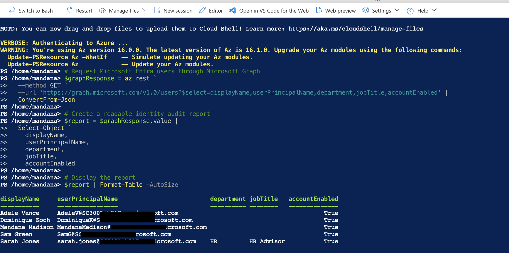
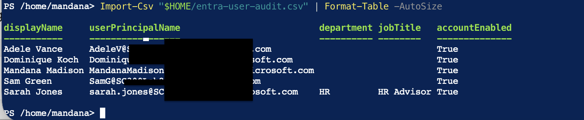

# Enterprise IAM Implementation

## Overview

This project demonstrates the implementation of a Microsoft Entra ID identity platform for a fictional organisation, **Northwind Digital Ltd**.

The objective is to design and configure a secure identity and access management (IAM) environment using enterprise best practices. The project follows the lifecycle of an IAM implementation, from user provisioning and security group design through to role-based access control (RBAC), multi-factor authentication (MFA), Conditional Access, identity governance and access reviews.

The implementation is carried out using a personal Microsoft Entra tenant configured to simulate an enterprise environment.

---

## Business Scenario

Northwind Digital Ltd is a growing SaaS organisation with approximately 500 employees across offices in London, Manchester and Miami.

As the organisation expands, a modern identity platform is required to centrally manage users, secure access to business applications and enforce least-privilege principles.

The IAM team has been tasked with implementing Microsoft Entra ID to:

- Centralise identity management
- Standardise user provisioning
- Implement role-based access control
- Improve authentication security
- Support future identity governance initiatives

---

## Project Objectives

- Configure a Microsoft Entra ID tenant
- Provision enterprise users
- Design security groups
- Implement role-based access control (RBAC)
- Configure Multi-Factor Authentication (MFA)
- Create Conditional Access policies
- Demonstrate Joiner, Mover and Leaver processes
- Document enterprise IAM implementation activities
- Troubleshoot identity and access issues

---

### Lab Environment

This project uses two Microsoft Entra ID lab environments:

- **Tenant 1:** Enterprise identity implementation (users, groups, RBAC, Administrative Units, provisioning).
- **Tenant 2 (Microsoft Entra ID P2):** Advanced security capabilities including MFA, Conditional Access and Identity Protection.

This approach allowed the project to demonstrate both foundational IAM administration and premium Microsoft Entra security features.

---
## Technologies Used

- Microsoft Entra ID
- Microsoft Azure
- Microsoft 365
- PowerShell
- GitHub
- Markdown

---

## Role-Based Access Control (RBAC)

To support the principle of least privilege, administrative responsibilities were delegated using built-in Microsoft Entra roles.

| User | Role | Purpose |
|------|------|---------|
| Global Administrator | Tenant administration | Full identity platform management |
| Daniel Patel | User Administrator | User lifecycle management and password administration |
| James Wilson | Security Reader | Security monitoring and identity investigation |

This approach reduces administrative risk by ensuring users receive only the permissions required for their responsibilities.

---

## Administrative Units

Administrative Units were implemented to represent Northwind Digital Ltd's regional offices.

This enables delegated administration by geographical location, allowing future expansion where regional IT teams could manage users within their own office without receiving tenant-wide administrative privileges.

Administrative Units created:

- London Office
- Manchester Office
- Miami Office

---

## Temporary Access Pass (TAP)

A Temporary Access Pass (TAP) was configured to support secure onboarding of new users.

### Purpose

Temporary Access Pass allows newly provisioned users to securely sign in for the first time and register stronger authentication methods such as:

- Microsoft Authenticator
- Passkeys (FIDO2)
- Software OATH Tokens

Using TAP removes the need to distribute long-lived temporary passwords and aligns with Microsoft's modern authentication recommendations.

### Business Scenario

As part of the joiner process at Northwind Digital Ltd, newly created employees receive a Temporary Access Pass from the IAM team. After signing in, users register Microsoft Authenticator before accessing corporate applications.

---

# Conditional Access Policies

To strengthen identity security and support a Zero Trust security model, three Conditional Access policies were designed and configured within Microsoft Entra ID.

---

## CA001 – Require MFA for Administrative Roles

### Purpose

Protect privileged identities by requiring multi-factor authentication for users assigned administrative directory roles.

### Configuration

- Applies to selected administrative directory roles
- Targets all cloud applications
- Grant access only after successful MFA
- Initially deployed in **Report-only** mode

---

## CA002 – Require MFA for Workforce Users

### Purpose

Extend multi-factor authentication protection across the organisation while maintaining emergency administrative access.

### Configuration

- Applies to all users
- Excludes the emergency access (break-glass) administrator account
- Targets all cloud applications
- Requires multi-factor authentication
- Initially deployed in **Report-only** mode

### Business Benefit

This phased rollout approach reduces organisational risk by allowing administrators to evaluate the impact of MFA before enforcing the policy across the workforce.

---

## CA003 – Block Legacy Authentication

### Purpose

Prevent the use of legacy authentication protocols that do not support modern authentication or multi-factor authentication.

### Configuration

- Applies to all users
- Excludes the emergency access account
- Targets all cloud applications
- Blocks legacy authentication clients
- Initially deployed in **Report-only** mode

### Business Benefit

Blocking legacy authentication significantly reduces the attack surface for password spraying and brute-force attacks while supporting Microsoft's Zero Trust recommendations.

### Security Strategy

The Conditional Access implementation follows a phased enterprise deployment strategy:

1. Protect privileged administrative accounts.
2. Extend MFA to the wider workforce.
3. Block insecure legacy authentication.

This approach aligns with Microsoft's Zero Trust security principles and demonstrates secure identity governance while minimising operational disruption during rollout.

---

## Identity Operations

The project includes realistic operational scenarios demonstrating day-to-day IAM activities.

| Scenario | Description |
|----------|-------------|
| Joiner | User provisioning and secure onboarding |
| Mover | Updating user attributes and access following a role change |
| Leaver | Secure offboarding and access removal |
| Sign-in Investigation | Authentication troubleshooting using Microsoft Entra Sign-in Logs |
| Audit Log Investigation | Reviewing administrative changes for auditing and compliance |

Detailed documentation can be found in the **documentation/** folder.

---

## PowerShell Automation

To demonstrate identity administration automation, I developed a PowerShell script in Azure Cloud Shell that retrieves Microsoft Entra ID user information using the Microsoft Graph API.

The script:

- Retrieves all users in Microsoft Entra ID
- Extracts key identity attributes
- Generates a reusable identity audit report
- Exports results to CSV for governance and compliance activities

### Skills Demonstrated

- PowerShell
- Azure Cloud Shell
- Microsoft Graph API
- Microsoft Entra ID Administration
- Identity Reporting
- Automation

**Documentation:** [PowerShell Automation](documentation/powershell-automation.md)

---

## Architecture

The solution uses Microsoft Entra ID to manage enterprise identities, authentication, role-based access control, identity lifecycle processes and security monitoring.

Conditional Access was implemented in a separate Microsoft Entra ID Premium (P2) tenant to demonstrate premium identity protection features. PowerShell automation was used to generate identity audit reports through the Microsoft Graph API.

---

## Conclusion

This project demonstrates the implementation of an enterprise Identity and Access Management (IAM) solution using Microsoft Entra ID.

The implementation covers identity lifecycle management, authentication, access control, security monitoring and automation through a realistic business scenario based on enterprise best practices.

The project also demonstrates practical experience with Microsoft Graph, PowerShell automation, Conditional Access, RBAC and identity investigations, reflecting responsibilities commonly performed by IAM engineers.

---

## Skills Demonstrated

- Microsoft Entra ID Administration
- Identity & Access Management (IAM)
- Role-Based Access Control (RBAC)
- Administrative Units
- Multi-Factor Authentication (MFA)
- Temporary Access Pass (TAP)
- Conditional Access
- Identity Lifecycle Management (JML)
- Sign-in Log Analysis
- Audit Log Investigation
- Microsoft Graph API
- Azure Cloud Shell
- PowerShell Automation
- Identity Reporting
- Zero Trust Security

---

