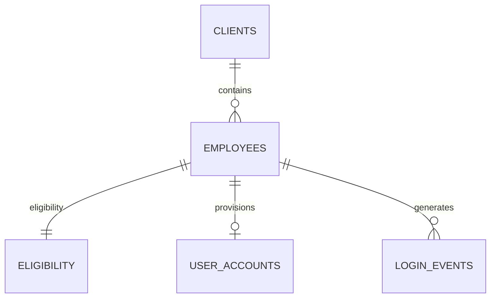
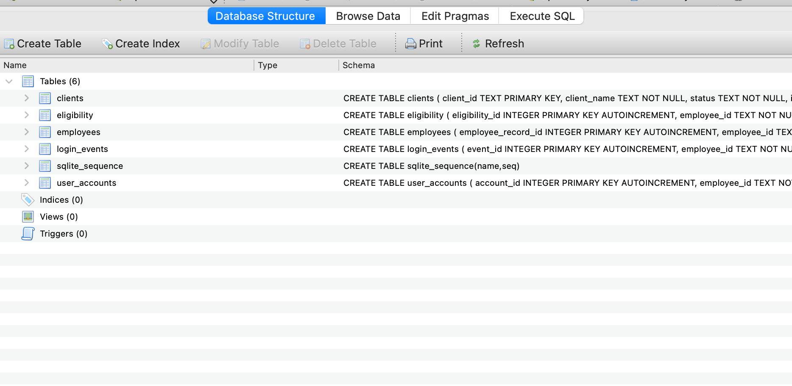
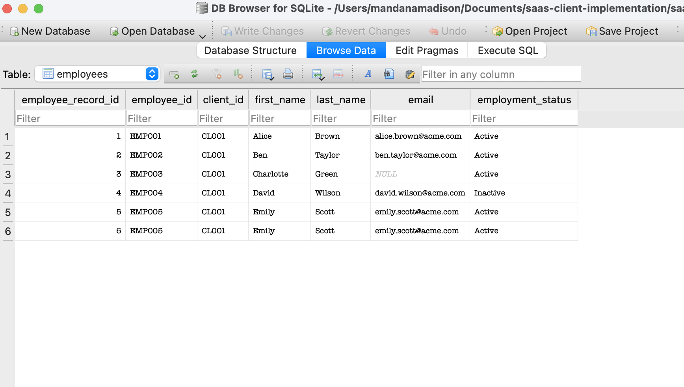
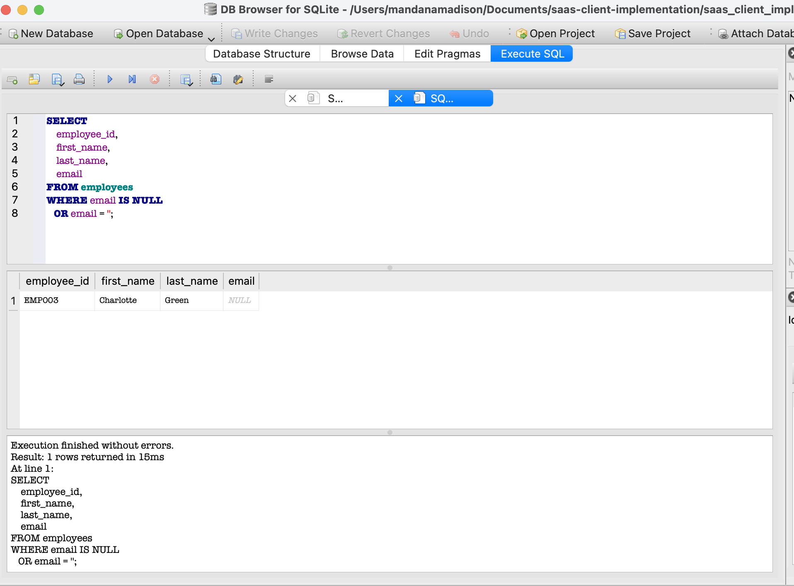
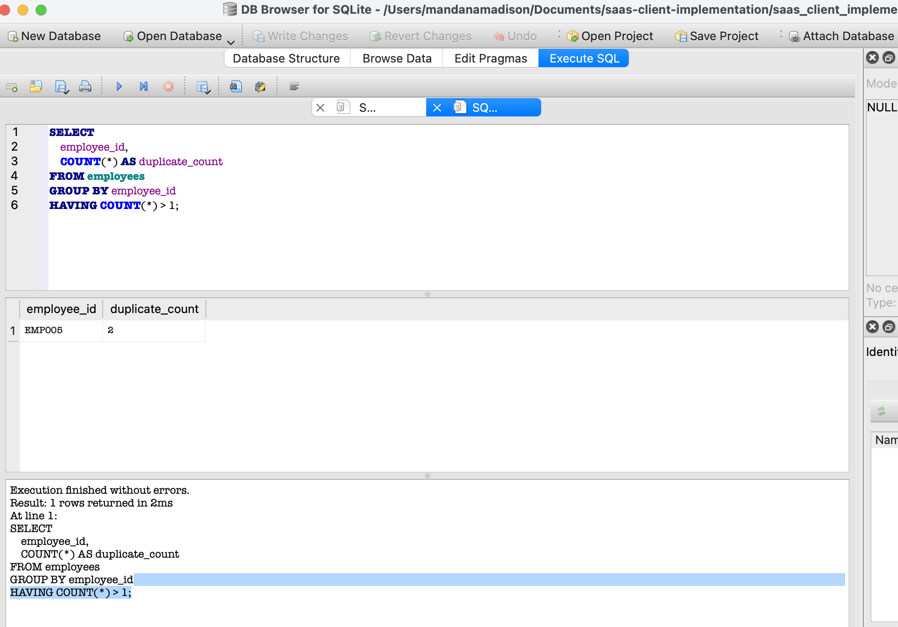
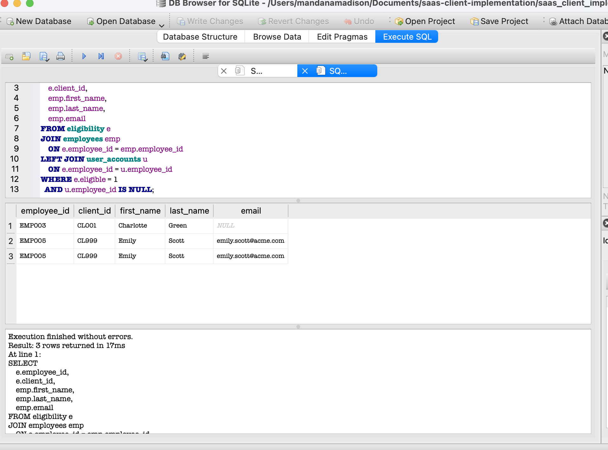
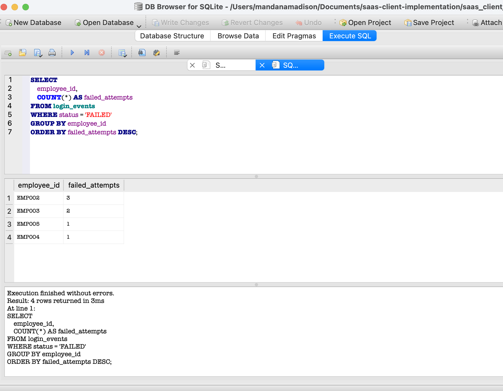
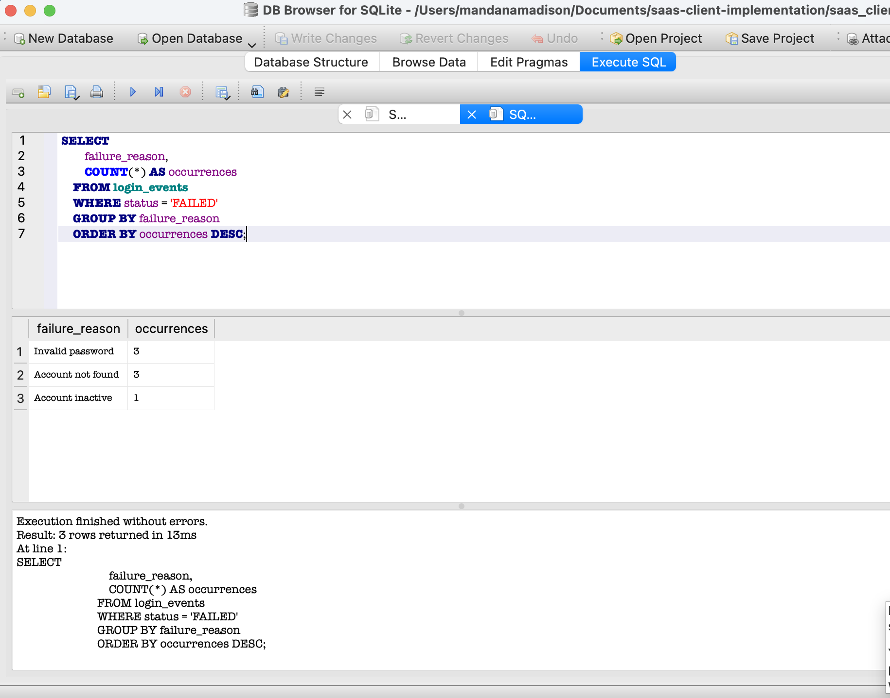
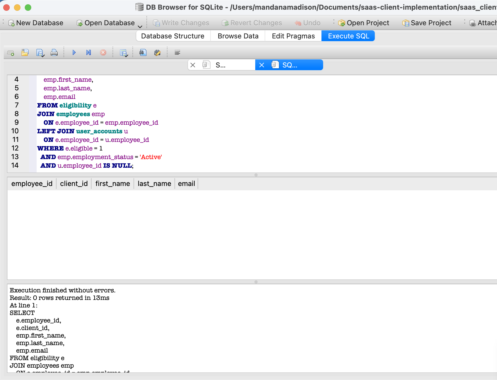

README.md

# Enterprise SaaS Client Onboarding Investigation

Production-style SQL investigation simulating enterprise SaaS user onboarding, identity provisioning and authentication troubleshooting.

## Overview

This project simulates a real-world SaaS client onboarding investigation where several employees were unable to access an enterprise application following user provisioning.

Using SQLite and SQL, I investigated the root causes of the onboarding failures, identified data quality issues, analysed authentication events, implemented remediation, and validated that the issues had been successfully resolved.

The project demonstrates a structured approach to production incident investigation similar to work performed by Solutions Engineers, Cloud Applications Analysts, IAM Engineers and Security Engineers.

## Key Achievements

- Designed a relational database for a SaaS onboarding scenario.
- Investigated production-style user provisioning issues using SQL.
- Identified duplicate records, missing employee data and authentication failures.
- Implemented data remediation and account provisioning.
- Validated successful resolution using post-remediation SQL checks.

## Business Scenario

A new enterprise client has completed employee onboarding into a SaaS platform.

Following deployment, several employees report that they cannot access the application.

The engineering team has been asked to investigate whether the issue is caused by:

- Missing employee data
- User provisioning failures
- Duplicate records
- Authentication failures
- Identity management issues

The objective is to identify the root cause, implement remediation, and validate the solution before the production rollout continues.

## Objectives

- Validate employee onboarding data
- Identify missing user information
- Detect duplicate employee records
- Verify successful account provisioning
- Analyse failed authentication events
- Remediate identified issues
- Validate successful resolution

## Database Architecture



## Project Structure

```text
saas-client-implementation/

README.md

documentation/
│
├── incident_report.md
├── implementation_plan.md
├── client_update.md
└── uat_test_plan.md

sql/
│
├── create_database.sql
├── insert_sample_data.sql
├── investigation_queries.sql
└── remediation.sql

screenshots/
│
├── 01-database-structure.png
├── 02-employees-table.png
├── 03-missing-email-query.png
├── 04-duplicate-employees.png
├── 05-eligible-users-without-accounts.png
├── 06-failed-login-summary.png
├── 07-authentication-failure-reasons.png
└── 08-post-remediation-validation.png
```

## Investigation Walkthrough

### 1. Database Structure

The database was designed to simulate a SaaS client onboarding process, including employee records, user accounts, eligibility data and authentication events.



---

### 2. Employee Data Review

The initial employee dataset was reviewed to identify potential data quality issues before account provisioning.



---

### 3. Missing Email Investigation

SQL queries identified employees with missing email addresses, preventing successful account creation.



---

### 4. Duplicate Employee Detection

Duplicate employee records were identified using SQL aggregation queries to prevent duplicate account provisioning.



---

### 5. User Provisioning Validation

Eligible employees without user accounts were identified to verify successful provisioning.



---

### 6. Failed Authentication Analysis

Authentication logs were analysed to identify repeated login failures.



---

### 7. Authentication Failure Investigation

Failure reasons were categorised to distinguish between user errors and provisioning issues.



---

### 8. Post-Remediation Validation

Following remediation, validation queries confirmed that all active eligible employees had been successfully provisioned and that no outstanding data quality issues remained.




## Business Value

This project demonstrates how structured SQL investigations can identify and resolve production onboarding issues before they affect end users.

By validating employee data, identifying provisioning failures and confirming successful remediation, the investigation helps improve data quality, reduce support requests and ensure a reliable onboarding experience.

The workflow reflects activities commonly performed by Solutions Engineers, Cloud Applications Analysts, IAM Engineers and Security Engineers when supporting enterprise SaaS platforms.

## Technologies Used

- SQLite
- DB Browser for SQLite
- SQL
- Git
- GitHub
- Markdown

## Skills Demonstrated

### Technical Skills

- SQL (SQLite)
- Database Design
- SQL JOINs
- Data Validation
- Root Cause Analysis
- Incident Investigation
- Authentication Analysis
- User Provisioning Validation
- Data Remediation
- UAT Validation

### Professional Skills

- Troubleshooting
- Analytical Thinking
- Technical Documentation
- Problem Solving
- Incident Reporting
- Client-Focused Communication


