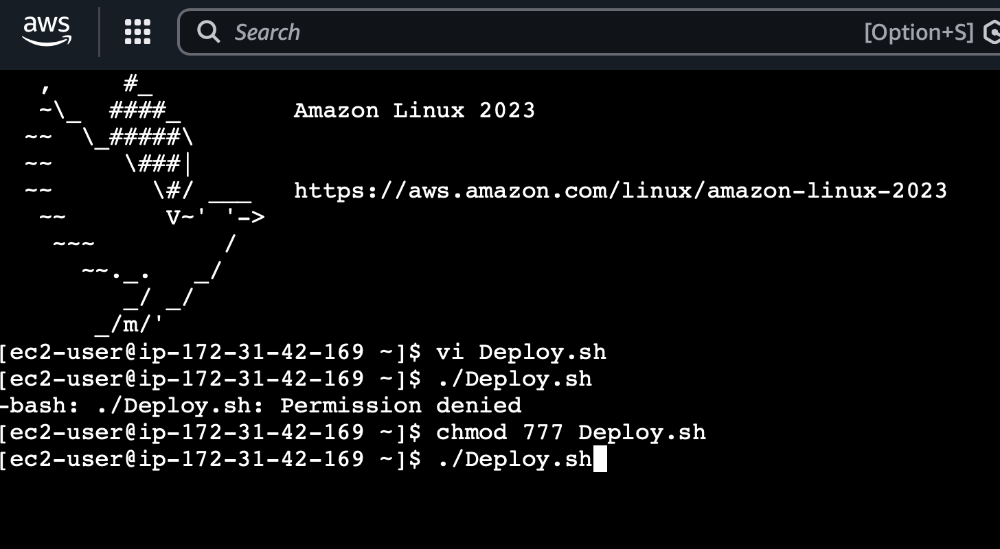
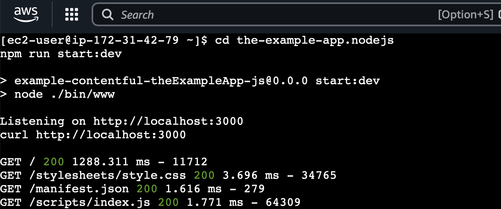
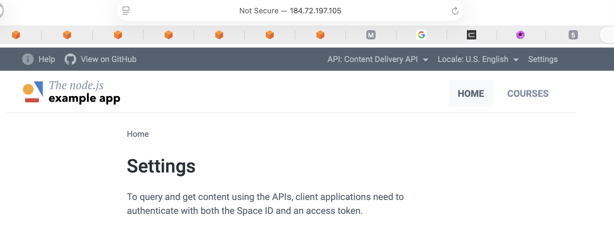

# 🐧 Linux Automation & Security Script (AWS)

## 🎯 Objective
The goal of this project was to automate application deployment and basic security configuration on an AWS EC2 instance.

---

## 🛠️ Tools Used
- AWS EC2 (Amazon Linux)
- Bash scripting
- Node.js
- Linux security tools

---

## ⚙️ What the Script Does
- Updates the system
- Installs Node.js and dependencies
- Installs Git and clones a repository
- Deploys and runs a web application
- Configures firewall rules
- Applies basic SSH hardening

---

## 🔐 Security Features
- Firewall configured to allow only necessary access
- SSH root login disabled
- Basic monitoring of failed login attempts

---

## 📸 Screenshots

---

## 🧠 Analysis
Automation reduces manual errors and ensures consistent system setup. Adding security configurations improves system protection against unauthorized access.

---

## 🌍 Real-World Relevance
Automation scripts are commonly used in cloud environments to deploy and secure systems efficiently.

---

## 🔐 Recommendations
- Restrict open ports further where possible
- Use key-based authentication only
- Regularly monitor system logs
