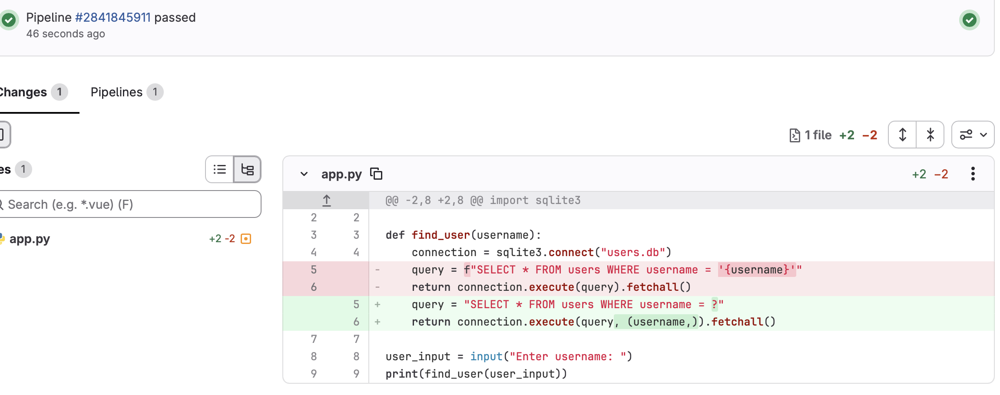

## SAST Pipeline Lab: Automated SQL Injection Detection

I built this project to get hands-on experience using SAST within a CI/CD pipeline. I created a small Python application containing an intentional SQL injection vulnerability, then configured Semgrep to scan the code automatically through GitLab CI/CD.

Semgrep detected two blocking findings and failed the pipeline, preventing the vulnerable code from passing the security check. I reviewed the findings, replaced the unsafe SQL construction with a parameterized query, and pushed the remediation. The pipeline ran again automatically and passed.

### What I practised

* Configuring Semgrep within a GitLab CI/CD pipeline
* Using SAST as an automated security gate
* Reviewing and validating security findings
* Remediating SQL injection with a parameterized query
* Troubleshooting CI/CD pipeline execution and validating the configuration
* Working with Git, Linux and YAML

### Result

**Vulnerable code → Semgrep finding → Failed pipeline → Secure remediation → Passed pipeline**

[View the full project on GitLab](https://gitlab.com/mandana-appsec/sast-pipeline-lab) · [View the remediation evidence](https://gitlab.com/mandana-appsec/sast-pipeline-lab/-/commit/0c28404f9ed2dd5f6503e6eb76e2b2a0e5a33606) · [View the successful pipeline](https://gitlab.com/mandana-appsec/sast-pipeline-lab/-/pipelines/2841845911)

## Remediation evidence

