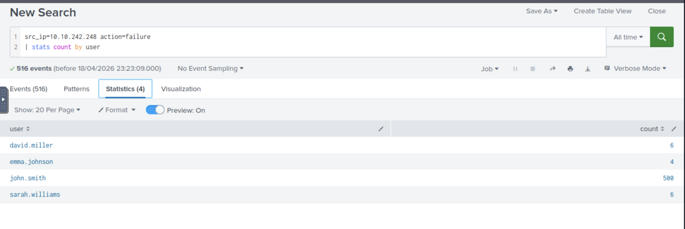

🛡️ SIEM Lab – Splunk (Log Analysis & Threat Detection)

🎯 Objective
The goal of this project was to use Splunk to analyze log data and detect suspicious activity within a simulated environment.

🛠️ Tools Used
Splunk
TryHackMe Lab Environment
Log Analysis

⚙️ Setup
Accessed Splunk environment through TryHackMe
Explored log data and search functionality
Used SPL queries to filter and analyze events

🧪 Investigation
Log Analysis
Searched logs for suspicious activity and filtered events using Splunk queries.

Base Search Query:
index="linux-alert" sourcetype="linux_secure" 10.10.242.248

Failed Login Analysis:
src_ip=10.10.242.248 action=failure
| stats count by user

🔍 Detection
Identified repeated authentication failures from source IP 10.10.242.248
Used Splunk statistics to group failed login attempts by user
Observed that user john.smith had over 500 failed login attempts
This pattern is consistent with a potential brute-force attack

📸 Screenshots
Base Search 

Failed Login Attempts by User

🧠 Analysis
Repeated failed login attempts indicate possible brute-force activity
Attackers often target user accounts with multiple password attempts
Log analysis enables detection of abnormal behavior and attack patterns
SIEM tools like Splunk provide visibility into system activity and threats

🌍 Real-World Relevance
Splunk is widely used in Security Operations Centers (SOC) to monitor logs, detect threats, and investigate security incidents.
Brute-force attacks are a common method used by attackers to gain unauthorized access to systems.

🔐 Recommendations
Implement account lockout policies after multiple failed attempts
Monitor login activity for unusual patterns
Use multi-factor authentication (MFA)
Configure alerts for repeated authentication failures
