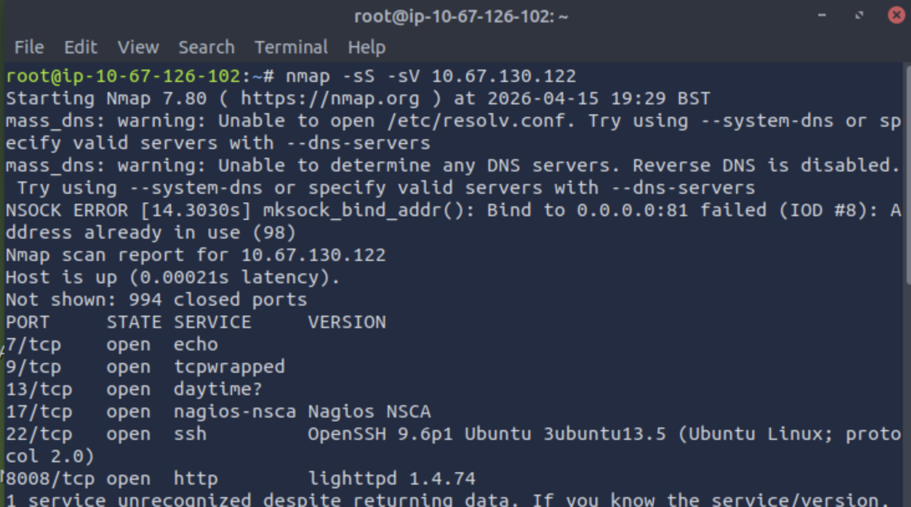

# 🔍 Nmap Scan Lab – TryHackMe

## 🎯 Objective

The goal of this lab was to learn and apply Nmap scanning techniques to identify open ports, services, and potential vulnerabilities on a target machine.

---

## 🛠️ Tools Used

* Nmap
* TryHackMe Lab Environment

---

## ⚙️ Methodology

### 1. Initial Scan

Performed a basic scan to discover open ports:
nmap <target-ip>

### 2. Service Detection

Identified services and versions:
nmap -sV <target-ip>

### 3. Aggressive Scan

Gathered detailed information:
nmap -A <target-ip>

---

## 🔍 Findings

- Port 21/tcp (FTP) was open, which could allow anonymous or unauthorized access
- Port 22/tcp (SSH) was open, making it a potential target for brute-force attacks
- Port 80/tcp (HTTP) was open, indicating a web server is exposed
- Open ports increase the attack surface and may expose vulnerable services

---

## 📸 Screenshots

---

## 🧠 Key Learnings

* How to identify open ports using Nmap
* Importance of service/version detection
* How attackers gather reconnaissance data

---

## ✅ Conclusion

This lab demonstrated how Nmap can be used to enumerate systems and identify potential attack vectors. Proper security configurations are essential to minimize exposure.

---

## 🔐 Recommendations

* Close unnecessary ports
* Keep services updated
* Monitor network activity

